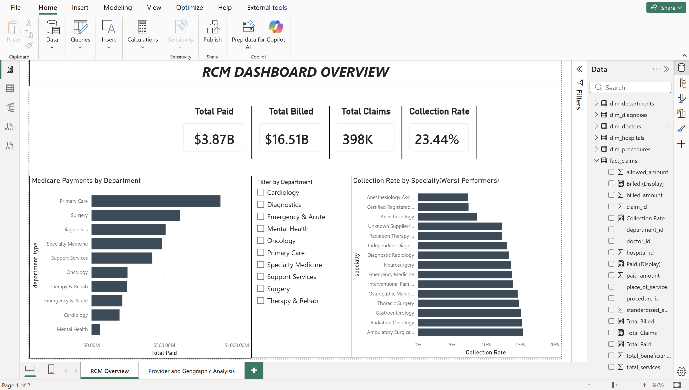
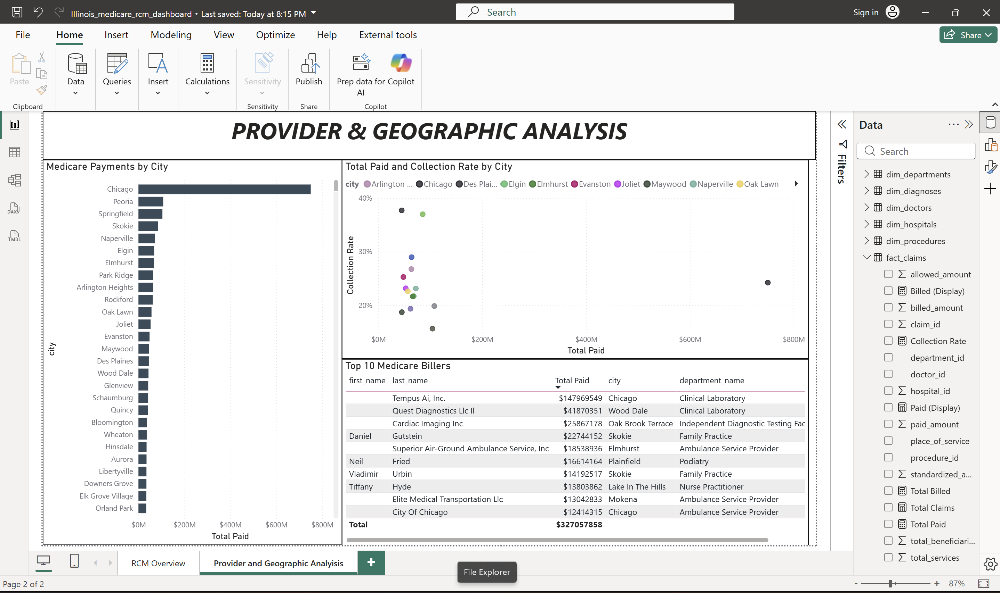

# Illinois Medicare Revenue Cycle Management (RCM) Analytics

An end-to-end data engineering and analytics project built on **real, public CMS data** — from raw government files to a MySQL star schema to an interactive Power BI dashboard. Every figure in this project traces back to an actual Medicare record, not synthetic data.

**Stack:** MySQL · SQL (window functions, CTEs) · Power BI (DAX) · Star-schema dimensional modeling

---

## What this project demonstrates

- Designing and loading a **star schema** (5 dimensions + 1 fact, ~398K claim lines) from three messy, real-world source files
- Solving genuine **ETL problems**: encoding mismatches, fixed-width parsing, currency-string cleaning, and connector restrictions
- Writing analytical SQL with **window functions and chained CTEs** to answer revenue-cycle business questions
- Building a connected, two-page **Power BI dashboard** with DAX measures over a live MySQL connection

---

## Data sources (all real & public)

| Source | Provider | Role in model |
|---|---|---|
| Medicare Physician & Other Practitioners, by Provider & Service (2024) | CMS | Core dataset → `fact_claims` |
| Hospital Price Transparency Enforcement Activities (Apr–May 2026) | CMS | `dim_hospitals` (Illinois compliance) |
| ICD-10-CM Diagnosis Code List (2026) | CMS / CDC | `dim_diagnoses` |

> Source files are **not committed** to this repo (they're large and publicly available). Download them from CMS and update the `LOAD DATA` paths in `01_data_loading.sql`.

---

## Data model

A classic star schema. The Medicare data is one row per provider + procedure, which supports a claims fact at that grain. `dim_hospitals` and `dim_diagnoses` are kept as **reference dimensions** — there is no real source for an admission- or diagnosis-level fact, so the model doesn't fabricate one.

```
        dim_doctors ─┐
      dim_procedures ┤
    dim_departments ─┼──►  fact_claims   (~398K real Medicare claim lines)
       dim_hospitals ┘     (reference)
       dim_diagnoses       (reference)
```

| Table | Rows | Description |
|---|---|---|
| `fact_claims` | ~398K | Provider × procedure claim lines with billed / allowed / paid measures |
| `dim_doctors` | ~48K | One row per provider (NPI), with specialty and entity type |
| `dim_procedures` | ~3,335 | One row per HCPCS code |
| `dim_departments` | 100 | ~100 specialties grouped into clean department buckets |
| `dim_hospitals` | 156 | Illinois hospitals + price-transparency compliance status |
| `dim_diagnoses` | ~74K | ICD-10-CM codes parsed into code / description / chapter |

---

## ETL highlights (real problems solved)

These weren't from a tutorial — they came up while loading actual government files:

- **`LOAD DATA LOCAL INFILE` restriction (Error 2068):** enabled `local_infile` on both the server and the connection to import client-side files.
- **Encoding mismatch:** the hospital file contains a byte that is invalid UTF-8 and aborts the import; loaded it as `latin1` so the load completes cleanly.
- **Fixed-width parsing:** the ICD-10 file is space-padded, not delimited — loaded each line whole, then sliced code (cols 1–7) and description (col 9+) with `SUBSTRING`.
- **Currency strings → numbers:** money columns arrive as text like `"$1,234.56"`; stripped `$` and `,` with nested `REPLACE`, then `CAST` to `DECIMAL` before aggregation.
- **Provider de-duplication:** collapsed the many service-line rows per provider down to one clean `dim_doctors` row with `GROUP BY`.

---

## Key findings

> **Note on "Collection Rate":** in this Medicare context, paid ÷ billed is the share of a provider's *list price* that Medicare pays — a payment-to-charge ratio, not a collections-performance metric. A low value reflects the gap between submitted charges and Medicare's fixed fee schedule.

- **$16.51B billed → $3.87B paid → 23.4% overall** payment-to-charge ratio across 398K claims.
- **Tempus AI, Inc.** is the single largest biller statewide at **$148.0M** (a clinical lab), followed by Quest Diagnostics ($41.9M) and Cardiac Imaging Inc ($25.9M).
- **Anesthesia specialties** show the widest billed-vs-paid gap (~7–9%), driven by Medicare's unit-based anesthesia pricing rather than poor collections.
- **Office visits** account for the largest absolute write-off (~$679M), driven by sheer volume.
- **Geographic concentration:** Chicago leads, with **Peoria #2 statewide (~$108M)**; the payment ratio varies by a city's *provider mix*, not its location.
- **Market concentration:** the Diagnostics department is highly concentrated — Tempus AI alone holds ~29% — while every other department is fragmented below 5%.

---

## Python / Pandas Analysis

Beyond the SQL and Power BI layers, the collection-rate analysis is reproduced in 
**Python (Pandas)** on the full ~398K-row fact table, pulled directly from MySQL via 
`read_sql` — demonstrating the same analysis in a second toolset and cross-validating 
the results.

**Data quality work:** validating on the full dataset surfaced **342 claims (0.09%)** 
where `allowed` or `paid` exceeded `billed` — logically impossible in a revenue-cycle 
context. Inspection traced these to under-recorded billed amounts; they were excluded 
with a documented filter (keeping 99.91% of the data) to prevent inflated 
payment-to-charge ratios.

**Result:** office claims show a ~33% payment-to-charge ratio vs ~20% for facility 
claims. The Pandas figures agree with the equivalent SQL `GROUP BY` query, validating 
the analysis across both tools.

See `medicare_rcm_analysis_final.ipynb`.

---

## Dashboard

A two-page Power BI report connected live to the MySQL star schema, with DAX measures (`SUMX` for billed/paid totals, `COUNTROWS` for claims, `DIVIDE` for the collection rate).

**Page 1 — RCM Overview:** KPI cards (Total Paid, Total Billed, Total Claims, Collection Rate), Medicare payments by department, a department slicer, and a worst-performers collection-rate chart.



**Page 2 — Provider & Geographic Analysis:** Medicare payments by city, a Total-Paid-vs-Collection-Rate scatter by city, and a Top 10 Medicare Billers table.



---

## Repository structure

```
.
├── README.md
├── LICENSE
├── sql/
│   ├── 01_data_loading.sql        # staging tables + LOAD DATA + sanity checks
│   ├── 02_data_cleaning.sql       # build & populate the star schema
│   └── 03_exploratory_data_analysis.sql   # 5 analytical queries
├── powerbi/
│   └── Illinois_medicare_rcm_dashboard.pbix
└── assets/
    ├── dashboard_1.png
    └── dashboard_2.png
```

---

## How to run

**Prerequisites**

- MySQL 8.0+ (server-side `local_infile` must be enabled for the loads)
- Power BI Desktop
- MySQL Connector/NET (required for Power BI's live MySQL connection)
- The three CMS source files (see *Data sources* above) downloaded locally

**Steps**

1. **Database:** run `sql/01_data_loading.sql` (edit the `LOAD DATA` paths first), then `02_data_cleaning.sql`, then `03_exploratory_data_analysis.sql`.
2. **Dashboard:** open the `.pbix` in Power BI Desktop and point the MySQL connection at your `healthcare_db` (server `localhost`, MySQL Connector/NET).

---

## Limitations & next steps

This project deliberately models only what the source data can honestly support. Known limitations, and where it would go next:

- **Reference-only dimensions.** `dim_hospitals` (Illinois compliance) and `dim_diagnoses` (ICD-10-CM) carry no foreign key into `fact_claims` — the Medicare service-line data exposes no hospital or diagnosis at the claim grain, so no join is fabricated. A natural extension is a standalone **hospital price-transparency compliance page** built on `dim_hospitals` as its own subject area, rather than forcing it onto the claims fact.
- **"Collection Rate" is a payment-to-charge ratio.** As noted above, paid ÷ billed measures the gap between a provider's list price and Medicare's fixed fee schedule — not real collections performance. A true RCM collections analysis would need denial, adjustment, and accounts-receivable data that public CMS files don't contain.
- **Single payer, single year, single state.** The fact table is 2024 Illinois Medicare only. Adding more years would enable trend analysis; adding other states would let the geographic concentration findings generalize.
- **Provider-level grain.** The data is one row per provider × procedure, so patient-level questions (episodes of care, readmissions) are out of scope by construction.

---

*Built as a portfolio project to demonstrate real-data SQL, dimensional modeling, and BI development.*
